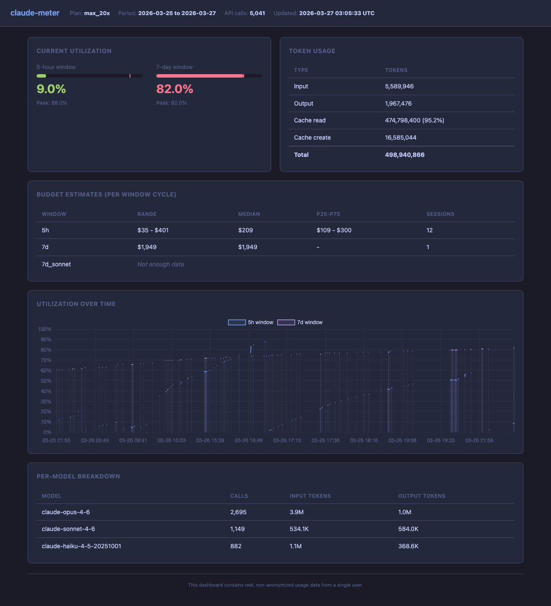

# Claude Meter

`claude-meter` is a local research proxy for understanding how Claude Code usage maps to Anthropic's hidden quota system.



**[Live Dashboard](https://abhishekray07.github.io/claude-meter/)**

The core problem is simple:

- Claude Max / Pro users can see rough usage state, but not the real hidden budget
- Anthropic appears to enforce multiple windows such as `5h` and `7d`
- Claude Code traffic includes useful usage and rate-limit signals, but they are not surfaced in a way that is easy to study over time

`claude-meter` sits between Claude Code and Anthropic, captures those signals locally, normalizes them, and helps estimate rough budget bands from real traffic.

## Status

This project is currently an `alpha research tool`, not a polished end-user product.

What that means:

- it is already useful for reverse-engineering and observing hidden quota behavior
- it is not yet an exact “Claude Max limit meter”
- current estimators produce rough ranges, not precise truth

The right way to think about the project today is:

- `working local proxy`
- `working local data capture`
- `working local normalization`
- `early-stage estimator`

## What We Are Trying To Do

The immediate goal is to answer questions like:

- what `5h` and `7d` quota windows does Claude Code actually see?
- how do different models affect those windows?
- do cache reads behave more like cheap API cost than raw token count?
- can we estimate a rough `5h` budget band with enough confidence to track changes over time?

The longer-term goal is bigger:

- help users understand their own hidden Claude usage limits
- detect changes in Anthropic behavior over time
- eventually compare behavior across plans, models, and accounts

## What Already Works

### Proxy

- transparent pass-through proxy for `api.anthropic.com`
- asynchronous logging so proxying stays ahead of disk writes
- all capture is local

### Raw Capture

- full raw request / response exchange capture
- raw JSONL written under `~/.claude-meter/raw/`
- request / response bodies persisted locally
- sensitive headers redacted before persistence
- raw directories and files created with private permissions

### Normalization

- normalized JSONL written under `~/.claude-meter/normalized/`
- background derivation from raw exchanges
- `/v1/messages` parsing
- `/v1/messages/count_tokens` parsing
- SSE parsing for real streamed Claude responses
- best-effort handling for partial gzip event streams
- header-driven fallback records for unknown endpoints

### Observed Signals

From live Claude Code traffic, `claude-meter` can already capture:

- `anthropic-ratelimit-unified-*` headers
- `5h` and `7d` utilization windows
- model-specific windows such as `7d_sonnet` when present
- `input_tokens`
- `output_tokens`
- `cache_creation_input_tokens`
- `cache_read_input_tokens`
- model names
- session ids
- declared plan tier

### Analysis

The current analysis layer can already:

- summarize observed windows
- compare raw-token and price-weighted usage formulas
- build interval-based estimates
- compute filtered `5h` estimate bands
- estimate dollar budgets per 5h and 7d window using API pricing
- show token usage breakdown (input, output, cache read, cache create)
- report current and peak utilization per window
- output a human-readable summary via `--summary` flag

## What Is Not There Yet

These are important gaps, not footnotes:

- no exact hidden-limit estimator
- no high-confidence scoring yet
- no automatic reset-aware experiment mode
- no packaged installer or background service
- no built-in anonymized sharing flow
- no cross-account comparison yet
- no strong claim that the current estimate band is “the true limit”

In particular, the estimator still has outliers. That is expected at this stage. The data capture is real; the hard part is interpreting a coarse hidden utilization meter.

## Current Working Thesis

The current working thesis is:

- raw token counting is too naive
- price-weighted usage appears to explain Anthropic's hidden `5h` meter better than raw token totals
- cache reads should likely be weighted much more cheaply than fresh input or output
- the useful product output is probably a `rough 5h budget band`, not a fake exact cap

So the project is moving toward:

- “you probably have roughly this much `5h` budget”
- not “you have exactly `N` tokens remaining”

## How It Works

1. Claude Code is pointed at the local proxy with `ANTHROPIC_BASE_URL`
2. The proxy forwards all traffic upstream unchanged
3. Raw exchanges are stored locally
4. A background normalizer derives structured records
5. Offline analysis scripts estimate behavior from those records

This separation is deliberate:

- live traffic path stays simple
- raw capture remains the local source of truth
- normalization can evolve
- estimator logic can be rewritten without touching the proxy

## Quickstart

### Option 1: One-liner install (builds from source)

```bash
curl -sSL https://raw.githubusercontent.com/opslane/claude-meter/main/install.sh | bash
```

### Option 2: Manual install (review source first)

```bash
git clone https://github.com/opslane/claude-meter.git
cd claude-meter
go build -o claude-meter ./cmd/claude-meter
./claude-meter start --plan-tier max_20x
```

### Run from source

Run the proxy:

```bash
go run ./cmd/claude-meter start --plan-tier max_20x
```

Point Claude Code at it:

```bash
ANTHROPIC_BASE_URL=http://127.0.0.1:7735 claude
```

Backfill normalized records from existing raw logs:

```bash
go run ./cmd/claude-meter backfill-normalized --log-dir ~/.claude-meter --plan-tier max_20x
```

Run the analyzer (human-readable summary):

```bash
python3 analysis/analyze_normalized_log.py ~/.claude-meter --summary
```

This reads all normalized logs and outputs:

```
claude-meter analysis
========================================

Plan: max_20x
API calls: 4,721
Period: 2026-03-25 21:55 -> 2026-03-26 22:15

Token Usage
--------------------
  Input:             5,509,548
  Output:            1,850,132
  Cache read:      443,884,520 (95.1%)
  Cache create:     15,574,984

Current Utilization
--------------------
  5h           2% (peak: 88%)
  7d           81% (peak: 81%)
  7d_sonnet    37% (peak: 37%)

Estimated 5h Budget (11 sessions observed)
--------------------
  Range:   $35 - $401
  Median:  $164
  p25-p75: $99 - $291

Estimated 7d Budget (1 session observed)
--------------------
  Estimate: ~$1,949

By Model
--------------------
  claude-opus-4-6                          2,423 calls
  claude-sonnet-4-6                        1,146 calls
  claude-haiku-4-5-20251001                  855 calls
```

For raw JSON output (e.g. for piping to other tools):

```bash
python3 analysis/analyze_normalized_log.py ~/.claude-meter/normalized/2026-03-26.jsonl --pretty
```

Generate charts and a markdown report:

```bash
python3 analysis/report.py ~/.claude-meter --output /tmp/cm-report
```

## Dashboard

Generate an interactive HTML dashboard with Chart.js charts:

```bash
python3 analysis/dashboard.py ~/.claude-meter --output index.html --open
```

Publish to GitHub Pages with one command:

```bash
make dashboard
```

This generates the HTML from your local data, then pushes it to the `gh-pages` branch.

## Privacy and Safety

Right now this is intentionally local-first.

- raw logs stay on disk on your machine
- headers with obvious secrets are redacted before persistence
- prompts and responses may still be present in local raw logs

This is acceptable for a research tool, but it is not yet the final product privacy posture.

## Roadmap

### Now

- tighten the estimator
- improve interval hygiene
- produce better `5h` estimate bands
- make the README and install path clear enough for alpha users

### Next

- add confidence scoring for estimate bands
- detect reset boundaries more explicitly
- improve model-aware analysis
- make it easier to run the proxy by default in daily Claude Code usage
- add better export / snapshot tooling for sharing findings

### Later

- compare plan tiers cleanly
- support anonymized summary sharing
- build a crowdsourced view of hidden quota behavior
- detect Anthropic changes over time across many users
- possibly add a lightweight UI on top of the local data

## Why Crowdsourcing Would Help

One account can tell you:

- what your own hidden meter appears to do
- what your own rough `5h` band looks like

Many accounts can tell you:

- whether `Pro`, `Max`, and higher tiers behave differently
- whether the same estimator works across accounts
- whether model-specific buckets are universal or account-specific
- whether Anthropic changes hidden limits over time
- whether an estimate band is stable or just a single-user artifact

That is why the long-term value is not just local observability. It is eventually building a better map of the hidden system.

## Repo Layout

- [cmd/claude-meter](/Users/abhishekray/Projects/opslane/claude-meter/cmd/claude-meter): proxy entrypoint and backfill command
- [internal/proxy](/Users/abhishekray/Projects/opslane/claude-meter/internal/proxy): transparent HTTP proxy
- [internal/normalize](/Users/abhishekray/Projects/opslane/claude-meter/internal/normalize): response parsing and normalized record derivation
- [internal/storage](/Users/abhishekray/Projects/opslane/claude-meter/internal/storage): raw and normalized JSONL writers
- [analysis](/Users/abhishekray/Projects/opslane/claude-meter/analysis): offline estimators and supporting scripts
- [docs/plans](/Users/abhishekray/Projects/opslane/claude-meter/docs/plans): implementation plans and design notes

## Current Recommendation

If you use `claude-meter` today, use it as:

- a local observability tool
- a research proxy
- a way to collect evidence

Do not use it yet as:

- a precise quota oracle
- a billing truth source
- a final “remaining tokens” meter
